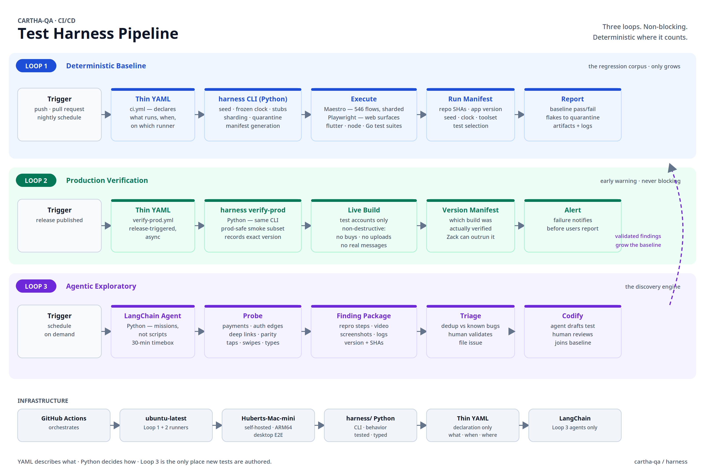

# Cartha Test Harness

The harness verifies Cartha's mobile, web, and desktop apps **without blocking
releases**. Zack ships when he is ready. The harness checks what shipped, warns
about defects before users find them, and grows smarter with every validated bug.



## The three loops

**Loop 1 — Deterministic baseline.** The regression corpus. Seeded data, a
frozen clock, stubbed external services, pinned tools. Same inputs give the
same outputs on every run. The corpus only grows; nothing removes coverage
without a recorded decision.

**Loop 2 — Production verification.** Runs after each release, asynchronously.
A fast smoke suite against the live build, using test accounts and strictly
non-destructive steps. If Zack outruns the harness, every report names the
exact build it verified.

**Loop 3 — Agentic exploratory.** LangChain agents probe the app with
time-boxed missions (payments, auth edges, deep links). Findings ship as
packages — repro steps, video, screenshots, logs. Humans validate; validated
bugs become tracked issues **and** new regression tests that join Loop 1. This
is the only place new tests are authored.

## Design rules

- **YAML describes what; Python decides how.** Workflow files stay thin —
  checkout, set up, call the CLI. All behavior lives in the `harness/` Python
  package: seed handling, sharding, manifests, quarantine. It is tested, typed,
  and runs the same on a laptop as in CI.
- **Determinism is a contract.** One seed propagates to backend, Maestro, and
  Playwright. No fixed sleeps, no silent retries, no random ordering. Flaky
  tests go to a visible quarantine with an owner — never silently dropped.
- **LangChain stays in Loop 3.** No model touches the deterministic path.

## Run it locally

```bash
pip install ./harness
harness run-smoke --seed 42        # Loop 1 smoke tier
harness verify-prod --version 1.2.3  # Loop 2 against a release
harness explore --mission payments  # Loop 3 exploratory mission
```

Every run writes a manifest (`run-manifest.json`) recording repo SHAs, app
version, seed, clock, tool versions, and test selection — so any run can be
replayed exactly.

## CI

| Workflow | Trigger | Runner |
|---|---|---|
| `ci.yml` | push, PR, nightly | `ubuntu-latest` |
| `verify-prod.yml` | release published | `ubuntu-latest` |
| `explore.yml` | schedule, manual | `ubuntu-latest` |
| desktop E2E | push, nightly | `Huberts-Mac-mini` (self-hosted, ARM64) |

The mini runner costs nothing and needs no cloud Mac minutes. Target it with
`runs-on: [self-hosted, macOS, ARM64]`.

## Layout

```
harness/
  README.md            # this file
  STRATEGY.md          # full strategy and phased plan
  cicd-pipeline.png    # architecture diagram
  cicd-pipeline.svg
  <python package>     # the harness CLI (Phase 1)
  smoke-manifest.yml   # curated smoke tier (from coverage assessment)
  missions/            # exploratory mission definitions
```

## Status

Phase 0 (coverage assessment) is next. See [STRATEGY.md](STRATEGY.md) for the
full phased plan and open decisions.
